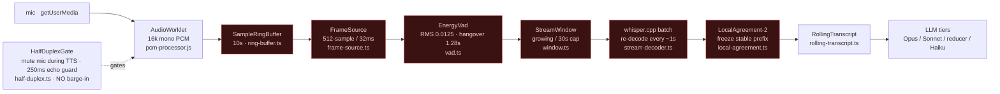
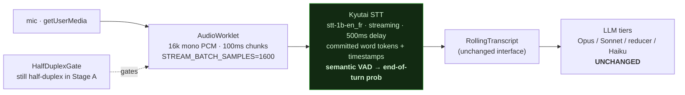
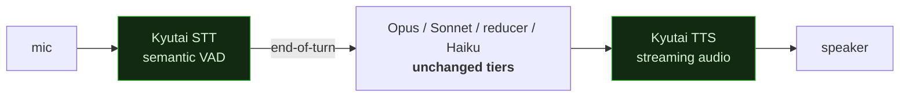
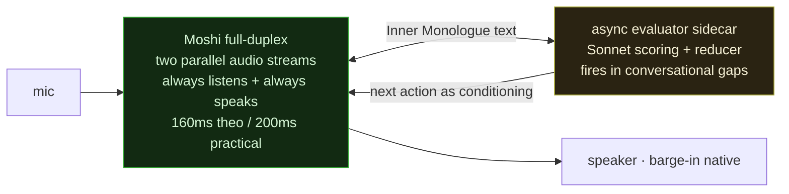

# Architecture — Full-duplex / streaming-STT migration

Part of the [architecture spec](../architecture.md) · supersedes the whisper front end in [voice.md](voice.md) · builds on [ai-layer.md](ai-layer.md).

Research basis: Moshi (arXiv:2410.00037, kyutai.org/Moshi.pdf), Mimi codec (HF `kyutai/mimi`), Delayed Streams Modeling + Kyutai STT (github.com/kyutai-labs/delayed-streams-modeling, kyutai.org/stt), Unmute (github.com/kyutai-labs/unmute), MoshiRAG (arXiv:2604.12928). All architecture claims here passed 3-vote adversarial verification against those primary sources.

The whole current voice stack is scaffolding around two facts: **whisper can't stream**, and **the LLM tier is turn-based**. Kyutai's stack dissolves the first fact cleanly and standalone; the second is a design choice we get to keep or shed. This doc commits Stage A, and frames Stage B vs Stage C for parallel branches.

---

## Stage A — swap the ASR front end (committed)

Replace batch whisper + all its streaming prostheses with **Kyutai STT** (`stt-1b-en_fr`, 500ms fixed delay, or `stt-2.6b-en` at 2.5s if WER demands). Kyutai STT is native-streaming, emits committed word tokens with timestamps, and carries a **semantic VAD** that predicts end-of-turn probability — on par with SOTA *non-streaming* accuracy, so no WER tax. The tiered LLM brain is untouched; this is a text-in/text-out swap behind the existing voice seam.

### Current pipeline (what Stage A deletes)

Red nodes exist **only** because whisper is batch. Stage A removes all six.

### Stage A pipeline (proposed)

**One green node replaces six red ones.** The energy-RMS VAD + fixed 1.28s hangover → a *semantic* end-of-turn signal (kills the "paused mid-thought, got cut off" failure class). Sliding-window re-decode + LocalAgreement-2 → committed streaming tokens (no diffing guesswork). Endpoint latency 1.28s → ~500ms.

### The seam

Stage A lives entirely behind `app/src/main/voice/`. The renderer capture (`recorder.ts` / `pcm-processor.js`) and the downstream `RollingTranscript` → IPC → LLM tiers are unchanged. Net-new is a Kyutai STT adapter (local server / websocket, GPU) implementing the same partial/final event shape the voice IPC already speaks (`voice:partial { text, stableUpTo }`, final on endpoint). `stableUpTo` becomes "all committed tokens" instead of "the LocalAgreement-frozen prefix" — the UI contract holds. Cost paid: GPU required (fine — demo target has one).

Stage A is **one user surface**. B and C fork from it.

---

## Keeping the value of tiered reasoning under full-duplex

Our tiers are not a chatbot — they're a structured evaluation engine:

- **Opus** — the `architect` tier — builds the interview roadmap once (structured plan from JD + resume).
- **Sonnet** — the `evaluator` tier — scores each answer into coverage dimensions (auditable rubric).
- **Deterministic reducer** (not an LLM tier) picks the next `InterviewAction` (inspectable, unit-tested).
- **Haiku** — the `conversation` tier — phrases one spoken line on the hot path.

(Tier names `architect` / `evaluator` / `conversation` are the routing vocabulary from [ai-layer.md](ai-layer.md); the reducer sits between `evaluator` and `conversation`.)

That structure *is* the product's credibility. Any full-duplex move must preserve it. Four avenues, in order of how much they keep:

1. **Cascade keeps it verbatim (= Stage B).** Unmute proves the text LLM is a swappable module (it runs GPT-OSS-120B in prod). Our entire Opus→Sonnet→reducer→Haiku pipeline drops in unchanged; we only upgrade STT/TTS. Zero reasoning loss. This is the "mimic = don't mimic, just keep it" answer.

2. **Async evaluator sidecar (= the MoshiRAG pattern, core of Stage C).** Let the full-duplex model own the *conversational surface* (listen, backchannel, phrase, barge-in). Its **Inner Monologue** emits time-aligned text for free — feed that transcript to our Sonnet-scoring tier running **asynchronously in conversational gaps**, exactly as MoshiRAG fires retrieval in natural pauses and reaches factual parity with turn-based models. The reducer's chosen next action is injected back as steering/conditioning. Our current 15s cache-and-hope steering poll is a crude version of precisely this; MoshiRAG is the principled one.

3. **Roadmap-as-context + observer scoring (simplest C-lite).** Prime the full-duplex model with the Opus roadmap up front, let it free-run, and run Sonnet scoring as a pure *post-hoc observer* that produces the evaluation report — not live steering. Keeps structured scoring for the write-up; loses live adaptivity.

4. **Constrained live conditioning (hardest).** Steer the full-duplex model turn-by-turn from the reducer via inner-monologue text prefixes. Maximum control + full duplex, but the injection-latency and testability story is unproven — research bet.

Avenue 1 is Stage B. Avenues 2–3 are Stage C. Avenue 4 is the far frontier.

---

## Stage B vs Stage C

### Stage B — Unmute-style cascade

Streaming STT + streaming TTS wrapping our exact tiers over a socket. LLM fires on the semantic end-of-turn. Retires the TTFT-guard / stall-watchdog scaffolding in favor of genuinely streamed audio. **Still half-duplex at the reasoning boundary** — no true overlap/barge-in while the tiers think.

### Stage C — native full-duplex (Moshi / MoshiRAG)

True barge-in, overlap, backchannels, ~200ms. The tiered brain becomes an **async out-of-band scorer/steerer** over Moshi's Inner Monologue, MoshiRAG-style. Yellow node is the unproven-but-exciting part.

### Cost / benefit ledger

| Dimension | Stage B — cascade | Stage C — native full-duplex |
|---|---|---|
| **Latency (end of speech → first audio)** | STT 500ms + tier round-trips + TTS start | ~200ms, no turn boundary |
| **Barge-in / overlap / backchannel** | ❌ none (turn-gated) | ✅ native |
| **Tiered reasoning** | ✅ **kept verbatim** (swappable LLM slot) | ⚠️ becomes async sidecar over Inner Monologue |
| **Auditability / testable reducer** | ✅ full — we own every tier | ⚠️ live steering emergent; observer-scoring stays testable |
| **Structured rubric scoring** | ✅ live, on the hot path | ✅ but async (in gaps) — parity shown by MoshiRAG |
| **Controllability of exact wording** | ✅ Haiku phrases every line | ⚠️ Moshi phrases; we steer, don't script |
| **Conversational naturalness** | good (streamed) | ✅ best — indistinguishable-from-human turn dynamics |
| **Build risk** | low–medium (evolution of today) | high (research-y; Avenue 2/4 unproven for us) |
| **New infra** | STT server + TTS server | Moshi + Mimi runtime + sidecar bridge + steering-injection |
| **Demo "wow"** | "it's fast and natural" | "it interrupts, gets interrupted, feels alive" |
| **Failure mode if it goes wrong** | degrades to today's feel | model rambles off-rubric; harder to constrain |

### The decision, sharpened

- **Stage B is the safe capture of ~90% of the perceived win** (streaming both ends) with **0% reasoning loss**. If the demo goal is "fast, natural, obviously better than the whisper build," B alone delivers it.
- **Stage C is the bet that pays in *interaction realism*** — barge-in and overlap are things B literally cannot do. It costs the live, hot-path, fully-auditable rubric; MoshiRAG is the evidence that async-in-the-gaps recovers the factual/structured parity, but *for our specific rubric-scoring* that's unproven and is the research to actually do on the C branch.
- Parallel-branch plan: land A, then **B branch = productionize the cascade**, **C branch = spike the MoshiRAG-style async sidecar** and measure whether async gap-scoring holds our coverage-dimension rigor. The go/no-go for C is that single measurement.
